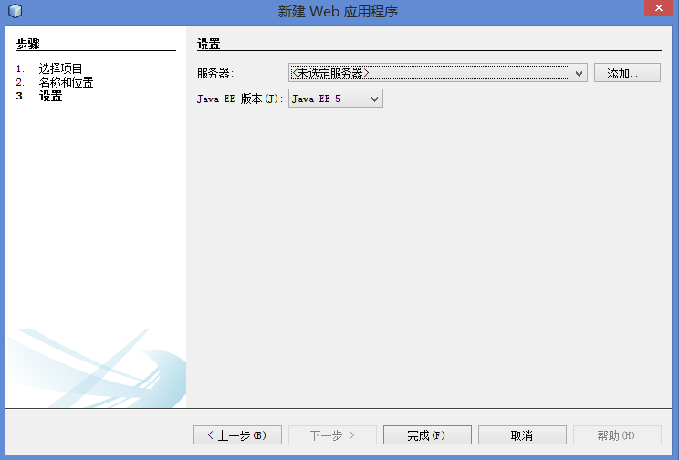
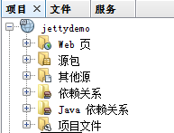
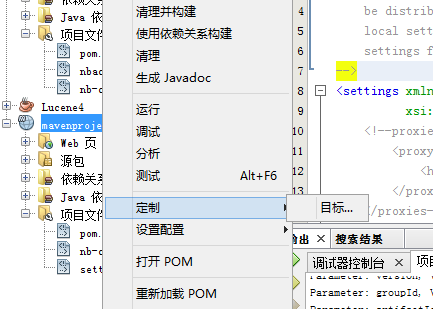
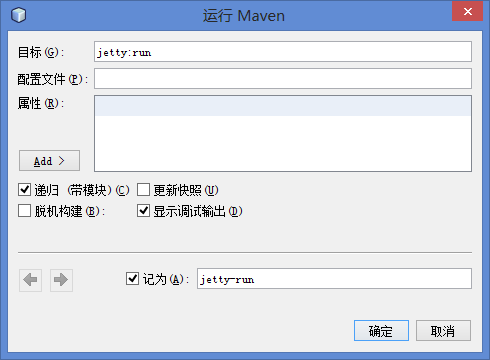
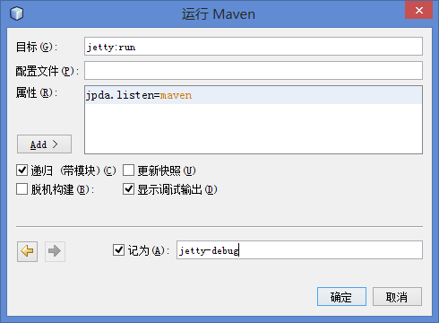
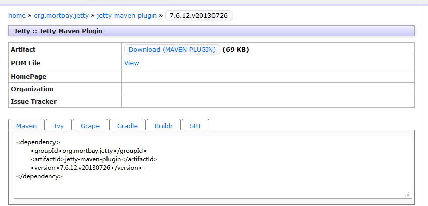
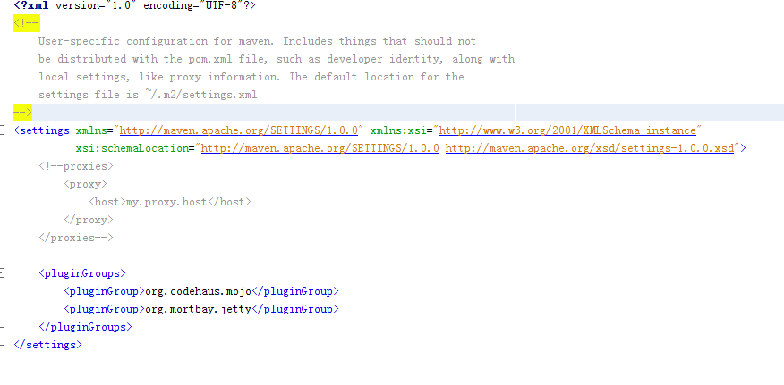

## 在Netbeans中使用Jetty进行Web项目的开发

在免费的Java IDE里，我想Netbeans比Eclipse好几个档次不止，当然丰富性来说没有Eclipse丰富。从到我现在的公司实习开始，就一直使用Netbeans，对它的好用与简洁方便真是赞叹不已。可惜的是甲骨文不太开放的社区政策，让Netbeans的插件相对于Eclipse和IDEA少了很多，也因此，要用到Jetty的时候，才需要经过下面这番折腾。

首先要明确的一点，就是现在已有的Jetty的Netbeans插件，已经没有用了，用不了了。而目前唯一可以在Netbeans下使用Jetty的方法，就是配合Maven。另外，Netbeans对Maven的支持是所有IDE里面最好的，非常非常方便。由于不想太繁琐，本文就不介绍Netbeans下如何配置Maven了。其实也不用配置，之所以要配置，是令Netbeans使用你安装的Maven而不是自带的。

然后创建一个Maven的Web项目，和在Netbeans下创建其他的项目没有多大的不同，就是到了这一步的时候  

不要选择服务器，因为我们要用Jetty做Web服务器。
项目创建好之后，会有如下的结构（我用的是Netbeans 7.3）：

  

下面的几步，你可以照着这篇文章来做：[《NetBeans 中使用 maven-jetty-plugin 运行与调试 web 项目 》](http://88250.b3log.org/netbeans-maven-jetty-plugin) ，按照这篇文章的步骤来，就差不多接近成功了。下面我主要照他的步骤来，之所以再记录一次，是怕那篇文章以后找不到了。

右键点击整个project，选择如下图：

选择目标，然后出现如下界面，按照界面中填入相同内容：

确定之后，会下载部分所需的东西。有可能就可以直进使用了，也有可能还需要下面更多的配置。这两种情况我都遇到了，但是进行了下面的配置，所有的问题都解决了，所以最好都按照下面的步骤完整配置完毕。

现在是可以进行run了，还缺少debug的部分。做项目，如果debug不了的话，基本上开发就进行不下去了。debug设置的流程和上面的run是一样的，只是填的东西不一样，填的东西如下：

 maven的有些东西我还没有搞明白。譬如我之前已经按照完整流程弄好了一个项目，然后新建一个web项目，下面的这些流程不需要都可以正常运行了。不是很懂的说。

现在，在“项目文件”里的pom.xml里的build里的plugins里添加如下内容：  

    <plugin>
    <groupId>org.mortbay.jetty</groupId>
    <artifactId>maven-jetty-plugin</artifactId>
       <version>8.1.10.v20130312</version>
    <configuration>
    <scanIntervalSeconds>5</scanIntervalSeconds>
    </configuration>
    </plugin>

这一段，说的是用8.1.10版本的Jetty，每5秒对项目进行一次扫描，看看更改了代码了否，更改了就重新部署。

现在第一个问题来了，如果我想用其他版本的Jetty怎么办？如果你对Maven很熟悉，自然没有问题。但是像我这样初来咋到的，就蒙了一会儿。还好有谷歌，直接在谷歌搜索栏里，按照这样的方式搜索：
>maven maven-jetty-plugin repository 

这样，第一条结果点击进去，就是该插件所有的版本了，[Jetty插件](http://mvnrepository.com/artifact/org.mortbay.jetty/jetty-maven-plugin)，自己点击去看看吧。比如我现在想用7.6版本的，那么我就点击进7.6的那个版本，然后可以看到如下界面：

  

把version那一段替换掉上面plugin里的就行了。

我按照着上面的步骤，用6.x版本的Jetty就已经能用了。可是当我想用Jetty 8的时候，却遇到了下面的问题：

 > No plugin found for prefix 'jetty' in the current project
 
还好找到了解决办法。右键点击项目的“项目文件”，选择添加settings.xml （不知道为什么，第一次是可以添加了，但如果有一个项目已经添加了的话，以后就添加不了了），如果添加不了，只要找到那个已经添加了settings.xml的项目，也是可以的。

然后，按照如图添加内容到settings.xml里：

现在，run或者debug你的Web项目吧，已经可以运行了。而且以后建立新的project也不用那么麻烦了。只要有上面的两个添加定制的步骤就可以了（还没有完全确定，但是应该可以的）